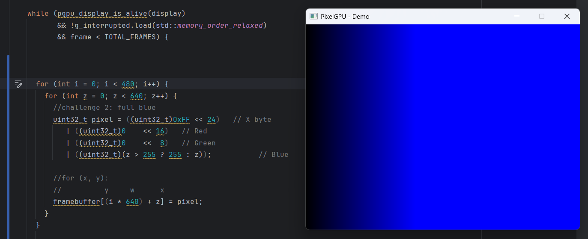
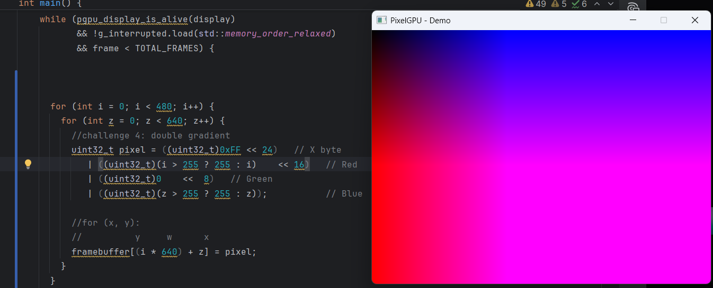
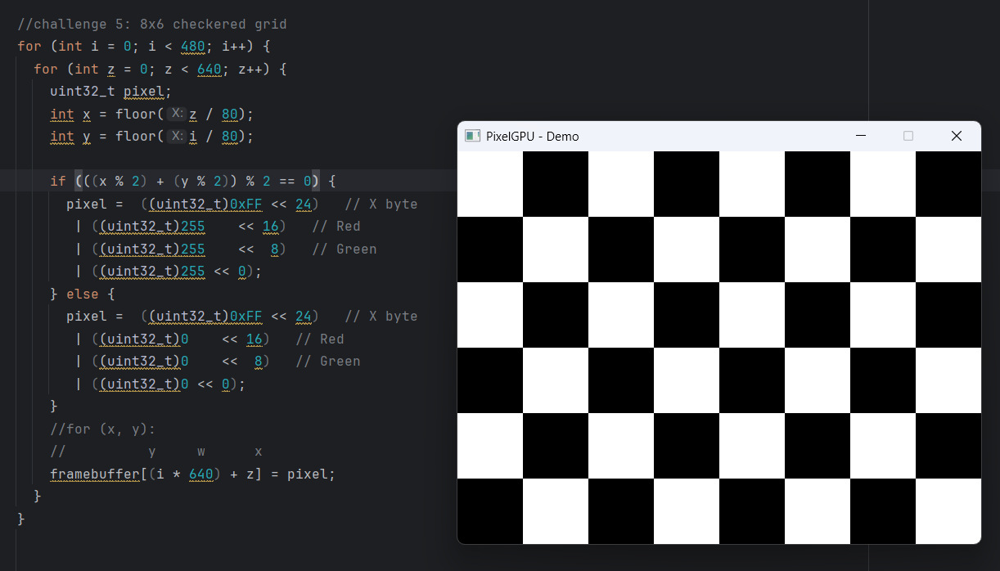
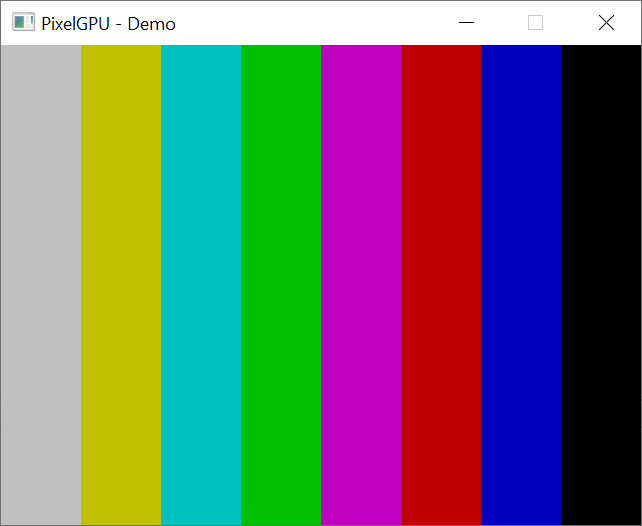
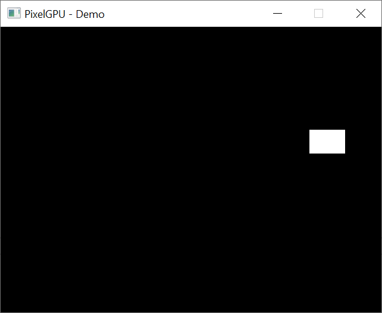
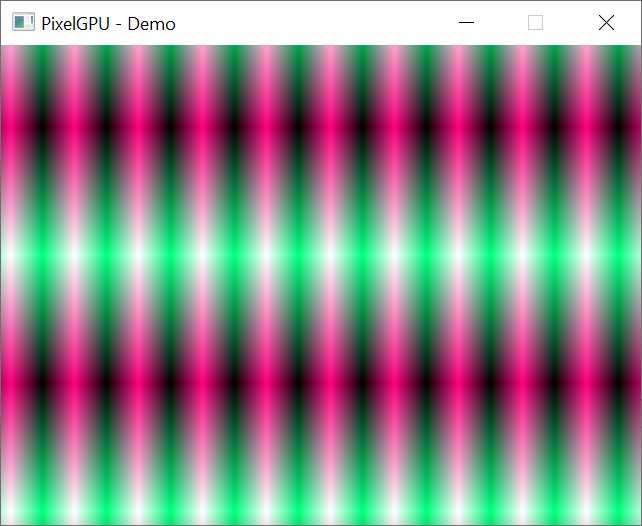

# "PixelGPU" Virtual Graphics Hardware and Driver Architecture Lessons

A teaching and exploration project for building a fake GPU into existence, then writing the full software stack around it.

The core idea is simple: start with a block of memory that acts like video RAM, display it in a real desktop window, and progressively evolve that illusion into a virtual graphics card with capabilities, registers, command queues, acceleration, and eventually 3D support.

This project is designed as a hands-on bridge between:

- software rasterization
- graphics fundamentals
- device-driver architecture
- virtual hardware and emulation
- legacy 3D pipeline design
- API compatibility layers
- performance engineering

The long-term stretch goal is to make the fake hardware capable enough that real existing software can run against it, ranging from simple 2D demos to classic game-era APIs.

---

## Project Goals

The project teaches students how graphics systems are really layered.

By the end, students should understand:

- how a framebuffer works
- how classic 2D drawing primitives are implemented
- why drivers submit commands instead of drawing directly
- how virtual hardware exposes registers and queues
- how a fixed-function 3D pipeline works
- how legacy graphics APIs map to hardware concepts
- how software and real GPU acceleration can sit behind the same virtual device contract
- how profiling and optimization reshape graphics architecture

The emphasis is on building abstractions in stages, not jumping immediately to OpenGL or Vulkan.

---

## Rough Development Process

The work is divided into nine progressive phases, each one preserving the public abstraction while improving the implementation underneath.

### Phase 1: Virtual Display Hardware
Create a desktop window (SDL or similar) backed by a byte array that acts as VRAM. Present that memory to the screen once per frame.

Exercise the framebuffer with several colorful and exciting drawing examples.

Sample output:

### Phase 2: Dumb 2D Framebuffer Driver
Build a software driver library implementing primitives such as pixel plot, lines, rectangle fill, clipping, blits, and text.

### Phase 3: Driver and Hardware Split
Separate the driver API from the virtual hardware implementation. Introduce command packets, registers, status flags, events, and a FIFO/ring buffer.

### Phase 4: Userspace and Kernel Boundary
Refactor the model to resemble a real OS graphics stack with memory mapping, command submission, synchronization, and optional kernel-facing interfaces.

### Phase 5: Software 3D Pipeline
Extend the fake hardware with fixed-function style 3D: transforms, triangle rasterization, z-buffering, texture sampling, and stateful draw commands.

### Phase 6: Compatibility Layer
Expose the virtual hardware through a small API surface that existing software can target, such as a raylib backend, MiniGL-style API, or retro game shim.

### Phase 7: Hidden Hardware Acceleration
Keep the virtual device API stable while replacing software internals with a faster backend such as OpenGL, shaders, or another host-accelerated implementation.

### Phase 8: Optimization and Profiling
Profile the full stack and improve performance through batching, cache-aware traversal, dirty rectangles, SIMD, tiled rendering, and improved synchronization.

### Phase 9: Real-World Architecture Comparisons
Compare the toy stack to real historical and modern systems including VGA, Voodoo-class fixed-function hardware, software rasterizers, and virtual GPU architectures.

---

## Testing Strategy

Every phase should be validated with repeatable image-based tests.

Recommended test approach:

- render known scenes into VRAM
- save reference PNG outputs
- compare against trusted raster libraries
- use pixel diffs for regression testing
- fuzz clipping and blit edge cases
- benchmark primitive throughput between phases

Never trust visual inspection alone.

---

## Why This Project Exists

Modern graphics APIs hide too much too early.

This project intentionally rebuilds the stack from first principles so students can experience the evolution from:

pixel buffer → framebuffer driver → command processor → virtual GPU → accelerated backend

That progression teaches not only graphics, but also systems design, interface stability, emulation, and performance engineering.

---

## Stretch Goals

Possible advanced extensions (spitballing here a bit):

- classic Glide-style compatibility shim
- MiniGL subset
- software Doom or Quake framebuffer backend
- network-transparent virtual GPU device
- host OpenGL backend swap

---

## Recommended Starting Milestone

The best first deliverable is intentionally small:

- SDL window
- linear 24-bit or 32-bit framebuffer
- `plotPixel()`
- Bresenham line drawing
- rectangle fill
- PNG regression tests

## AI/LLM Disclosure

This project is created by a graphics expert with over 40 years experience doing computer graphics. I started with the 8-bit Commodore 64, continuing through the 16/32-bit Amigas, and then on to workstation Unix/Windows NT computers with the earliest commodity graphics cards and on to modern Windows and Linux computers with supercomputer-class GPUs. However, since this is a not-for-profit passion project in free time, created by someone who works for a living, of necessity, advanced coding LLM tools are being used to accelerate research, planning and development. This isn't a "tell the AI what to do and sit back", it's a very interactive process, guiding it to the correct topics, materials, concepts and implementations. Everything produced by AI tools is reviewed, edited and improved by humans.